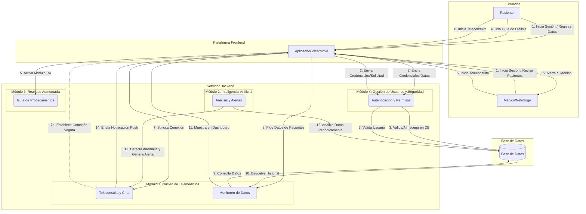

```mermaid
graph TD
    subgraph "Usuarios"
        P[<fa:fa-user> Paciente]
        M[<fa:fa-user-md> Médico/Nefrólogo]
    end

    subgraph "Plataforma Frontend"
        App[<fa:fa-mobile-alt> Aplicación Web/Móvil]
    end

    subgraph "Servidor Backend"
        direction LR
        subgraph "Módulo 4: Gestión de Usuarios y Seguridad"
            Auth(<fa:fa-lock> Autenticación y Permisos)
        end

        subgraph "Módulo 1: Núcleo de Telemedicina"
            TC(<fa:fa-video> Teleconsulta y Chat)
            Monitor[<fa:fa-heartbeat> Monitoreo de Datos]
        end

        subgraph "Módulo 2: Inteligencia Artificial"
            IA(<fa:fa-brain> Análisis y Alertas)
        end

        subgraph "Módulo 3: Realidad Aumentada"
            RA(<fa:fa-vr-cardboard> Guía de Procedimientos)
        end
    end

    subgraph "Base de Datos"
        DB[(<fa:fa-database> Base de Datos)]
    end

    %% --- Flujos de Interacción ---

    %% Flujo de Paciente
    P -->|1. Inicia Sesión / Registra Datos| App
    App -->|2. Envía Credenciales/Datos| Auth
    Auth -->|3. Valida/Almacena en DB| DB
    P -->|4. Usa Guía de Diálisis| App
    App -->|5. Activa Módulo RA| RA
    P -->|6. Inicia Teleconsulta| App
    App -->|7. Solicita Conexión| TC

    %% Flujo del Médico
    M -->|1. Inicia Sesión / Revisa Pacientes| App
    App -->|2. Envía Credenciales/Solicitud| Auth
    Auth -->|3. Valida Usuario| DB
    App -->|8. Pide Datos de Pacientes| Monitor
    Monitor -->|9. Consulta Datos| DB
    DB -->|10. Devuelve Historial| Monitor
    Monitor -->|11. Muestra en Dashboard| App
    M -->|6. Inicia Teleconsulta| App

    %% Flujo de Alertas (Backend)
    IA -->|12. Analiza Datos Periódicamente| DB
    IA -->|13. Detecta Anomalía y Genera Alerta| TC
    TC -->|14. Envía Notificación Push| App
    App -->|15. Alerta al Médico| M

    %% Flujo de Teleconsulta
    TC -.->|7a. Establece Conexión Segura| App
```
